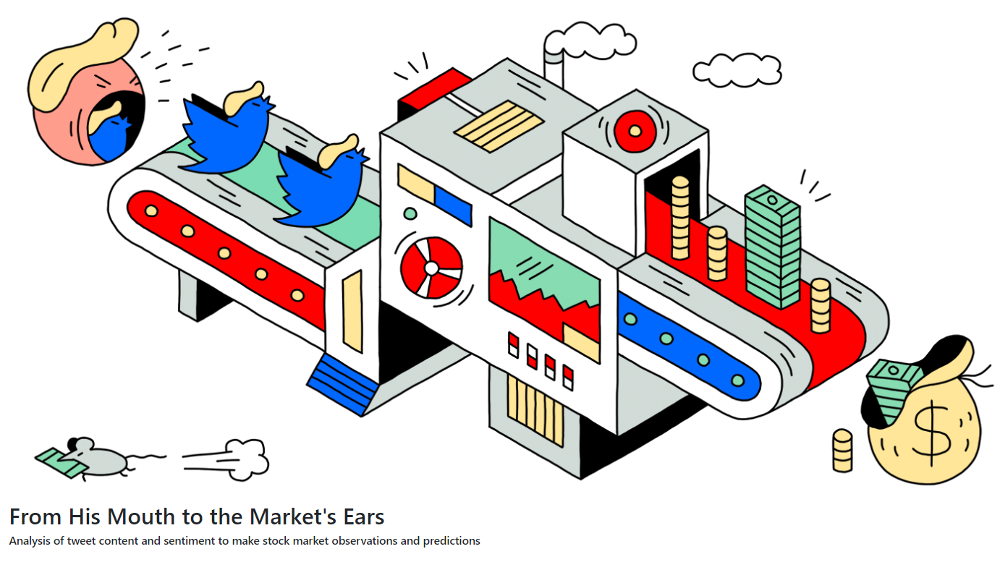
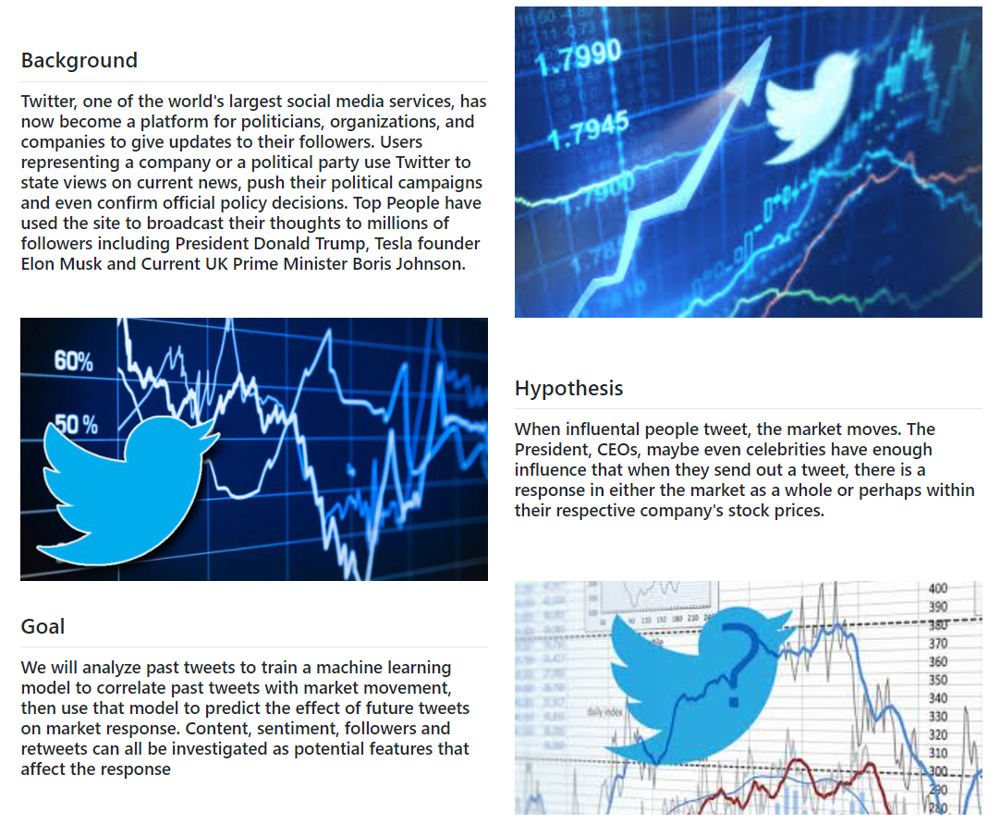
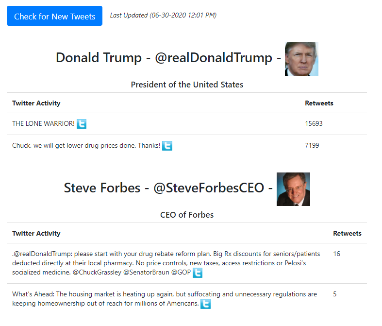
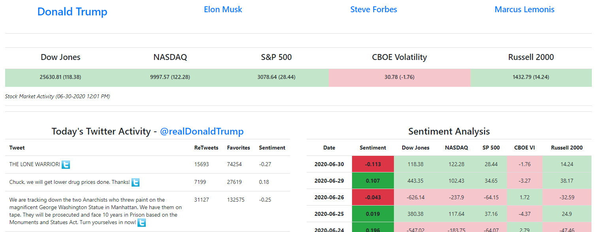
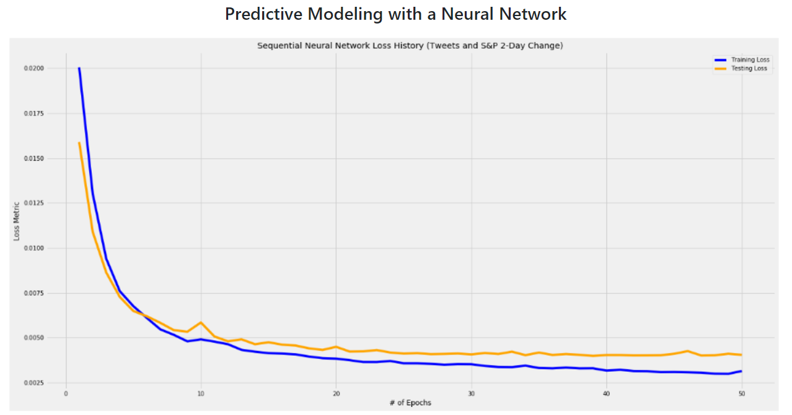

# Project-Twitterverse

Analysis of tweet content and sentiment to make stock market observations and predictions

Flask App previously hosted on Pythonanywhere.com

http://intothetwitterverse.pythonanywhere.com/

### Screenshots

#### Update most recent twitter and stock market activity with python script

#### Evaluate tweet sentiment and compare with market activity

#### Use historical data to create predictive model to anticipate market activity

